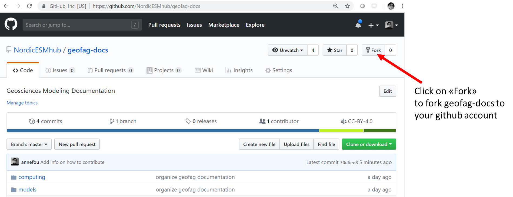
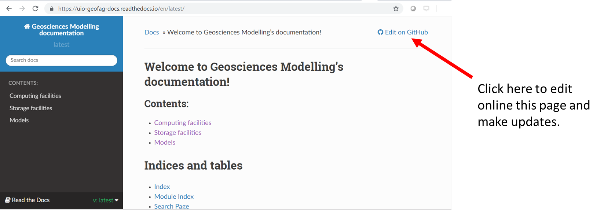
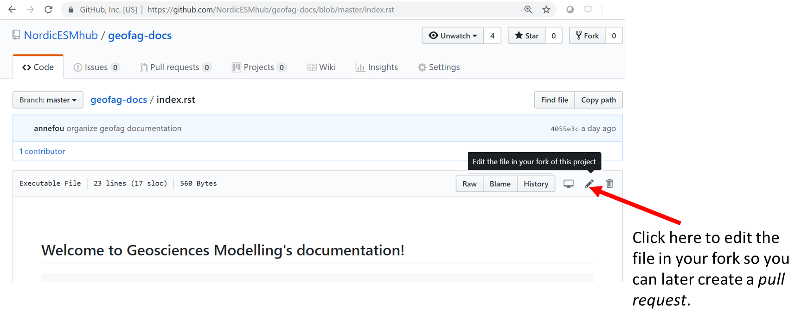
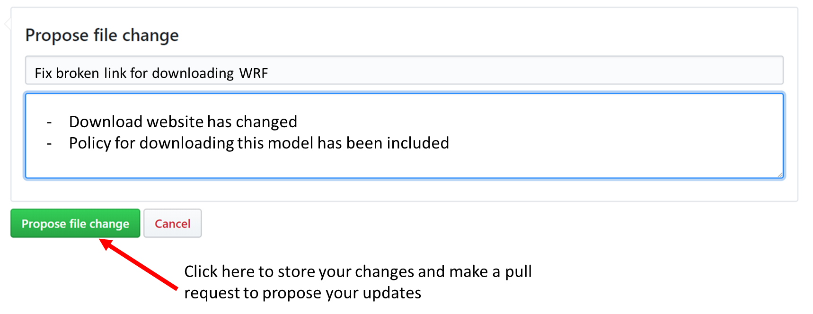

# Contributing to Geosciences Modelling’s documentation

Welcome to the Geosciences Modelling's documentation!

Thank you for your interest in contributing to geofag-docs. 

This documentation is meant to provide a resource for those at UiO interested in working with computer modeling 
and data analysis in Earth Sciences. It provides information on software tools available for data analysis 
and scientific program for projects within the field of Geosciences in general and to provide users a central 
resource for keeping notes on UIO specific aspects of running various software routines. 
Ideally, this site will become overtime a 'go to' location where incoming students who will be working 
with modeling and heavy data analysis on servers can find tips for getting started.

This documents is a set of guidelines for contributing to the Geosciences Modelling's documentation on GitHub. These are guidelines, not rules. This guide is meant to make it easy for you to get involved.

## How to contribute to geofag-docs?

- step 1: Fork this repository as shown in the figure below.

- step 2: Go online to [NorESM documentation](https://uio-geofag-docs.readthedocs.io/en/latest/) and whenever you would like to update the documentation, click on "Edit on GitHub".

- step 3: Then click on the "pen" (see image below) and write your text ([reStructuredText](http://docutils.sourceforge.net/docs/user/rst/quickref.html)) 

- step 4: Save your changes in your forked repository and create a pull request.

If you do not like to update the documentation online and prefer to use your favorite editor locally on your machine/laptop, you can skip step-3 and 4 and then clone your forked repository to edit the files locally. Once pushed to your forked github repository, you can create a pull request and propose your changes.

