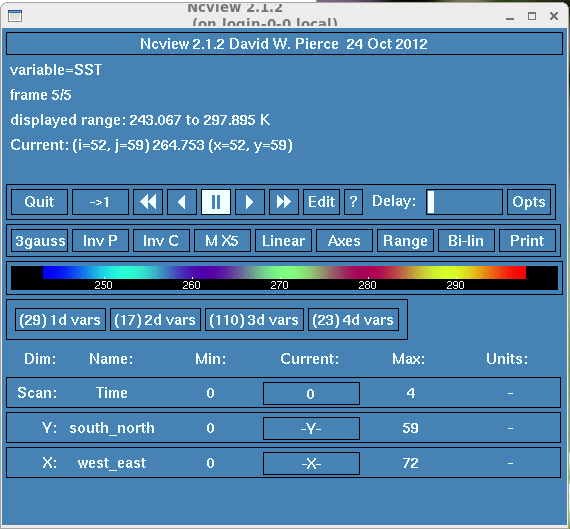
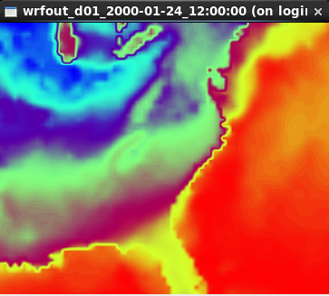
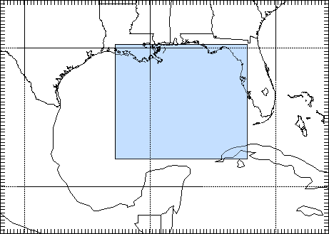

WRF model 
==========

WRF and WRF-CHEM have been installed on Abel. To check which version is
available:

::

   module avail wrf

   ------------------------ /cluster/etc/modulefiles --------------------------
   wrf/3.9.1.1

| 
| To set-up your environment for WRF (no chemistry):

::

   export WRF_CHEM=0
   module load wrf/3.9.1.1

   
| 
| To set-up your environment for WRF-CHEM (with chemistry):

::

   module load wrf/3.9.1.1
     

| 
| When loading wrf, the following environment variables are defined:

-  **WRF_HOME**: directory where WRF has been installed; this can be
   used to check WRF sources
-  **WPS_HOME**: directory where WPS has been installed. It is unlikely
   you have to check or change WPS source code but you will find in this
   directory all the metadata required to run WPS (the `GEOGRID.TBL`_,
   `METGRID.TBL`_, and `Vtable`_ files).
-  **WPS_GEOG_PATH**: contains the\ `terrestrial static input data`_.
   Even if you use your own compiled version of WRF/WPS, it is NOT
   necessary to download these files again.
-  **WRFIO_NCD_LARGE_FILE_SUPPORT**: it is set to 1 to allow you to
   store large netCDF files (more than 2GB).
-  **WRF_EXAMPLES**: directory where all WRF and WRF-CHEM examples are
   stored. If you wish to run one of this example see our dedicated
   section on running tutorials.

 

WRF has been compiled with intel compilers and MPI:

::

   module list 

   Currently Loaded Modulefiles:
  1) use.own                 4) hdf5/1.8.14_intel       7) jasper/1.900.1         10) wrf/3.9.1.1
  2) intel/2015.0            5) netcdf.intel/4.3.3.1    8) ncl/6.2.0
  3) openmpi.intel/1.8.3     6) intel-libs/2013.sp1.3   9) Anaconda3/5.1.0

| 
| We suggest you specify the version you wish to use to avoid any
  problems if we install a new default version (as it is important to
  stick to the very same version for your  simulations).

| 

Running WRF:
------------

The following steps are necessary to run WRF on our systems:

#. WRF Preprocessing System (WPS)
#. WRF System

WRF Preprocessing System (WPS)
~~~~~~~~~~~~~~~~~~~~~~~~~~~~~~

Most parameters for WPS must be given in namelist.wps

define_grid.py uses namelist.wps to plot your define

Most parameters for WPS must be given in namelist.wps

-  define_grid.py uses namelist.wps to plot your defined grid
-  run_geogrid.py  runs geogrid.exe to create static data for your
   domain
-  run_ungrib.py runs ungrib.exe to unpack your input GRIB data
-  run_metgrid.py runs metgrid.exe to interpolate input data onto your
   model domain

WRF
~~~

Most parameters for WRF must be given in namelist.input

-  run_init_wrf.py runs real.exe to initialize WRF and creates two files
   such as wrfinput_d<domain> and wrfbdy_d<domain> where <domain> is the
   domain number (01, 02, etc.)

-  run_wrf.py runs the numerical integration program wrf.exe

| 

TIPS: to get the usage of these python scripts, use -h or --help. For
instance:

::

   run_ungrib.py -h
   Usage: run_ungrib.py --expid expid --vtable vtable --datadir datadir [--start_date startdate --end_date enddate] [--interval_seconds val] [--prefix FILE]

   Options:
     -h, --help            show this help message and exit
     -s startdate, --start_date=startdate
                            A list of MAX_DOM character strings of the form
                           'YYYY-MM-DD_HH:mm:ss' specifying the starting UTC date
                           of the simulation for each domain.
     -e enddate, --end_date=enddate
                           A list of MAX_DOM character strings of the form 'YYYY-
                           MM-DD_HH:mm:ss' specifying the ending UTC date of the
                           simulation for each domain
     -t interval_seconds, --interval_seconds=interval_seconds
                           The integer number of seconds between time-varying
                           meteorological input files. No default value.
     -p FILE, --prefix=FILE
                           prefix of the intermediate meteorological data files
     -v Vtable, --vtable=Vtable
                           vtable filename
     -i expid, --expid=expid
                           Experiment identifier
     -d datadir, --datadir=datadir
                           Directory where input fields can be found

::

For each of these python scripts, some arguments are optionals and
indicated in squared brackets such as start_date and end_date. If you
don't specify them on the command line, it will keep what has been
defined in your namelist.  This is usually how you will run your "real"
cases.

WRF examples:
-------------

All WRF examples can be found in $WRF_EXAMPLES

A subdirectory can be found for each example and it contains all you
need to run the corresponding examples (namelist.wps, namelist.input,
Vtable, workflow.bash, and all the DATA required to run the simulation).
You may found one or more files named workflow*.bash. These files are
describing the sequence of programs to run for each example and can be
divided in two groups:

| 

`January2000Case`_
~~~~~~~~~~~~~~~~~~

This case is the East Coast Winter Storm of January 24-25, 2000
(http://cimss.ssec.wisc.edu/goes/misc/000125.html)

To run it, you need to execute each of the statement in workflow.bash:

| 

.. code:: bodytext

   > cat workflow.bash
   #!/bin/bash

   # check your domain is OK
   define_grid.py --path /cluster/software/VERSIONS/wrf/examples/January2000Case

   # Run geogrid.exe to create static data for this domain:
   run_geogrid.py -p /cluster/software/VERSIONS/wrf/examples/January2000Case --expid January2000Case

   # Unpack input GRIB data (ungrib.exe)
   run_ungrib.py --expid January2000Case             \
                 --start_date 2000-01-24_12:00:00    \
                 --end_date 2000-01-25_12:00:00      \
                 --interval_seconds 21600            \
                 --prefix FILE                       \
                 --vtable  /cluster/software/VERSIONS/wrf/examples/January2000Case/Vtable \
                 --datadir /cluster/software/VERSIONS/wrf/examples/January2000Case/DATA/

   #Interpolate the input data onto our model domain (metgrid.exe)
   run_metgrid.py --expid January2000Case

   # Initialize WRF model (real.exe/ideal.exe)
   run_init_wrf.py --expid January2000Case \
                   --namelist /cluster/software/VERSIONS/wrf/examples/January2000Case/namelist.input

   # Run the model (wrf.exe)
   run_wrf.py --expid January2000Case \
              --namelist /cluster/software/VERSIONS/wrf/examples/January2000Case/namelist.input

| 
| You don't have to change paths or namelists. it has been set-up to
  execute WPS/WRF in your workdir ($WORKDIR) and a subdirectory named
  January2000Case (named from your experiment identifier given with
  --expid option).

To visualize your outputs (named wrfout*), you may use `ncview`_:

::

             module load ncview

             ncview wrfout_d01_2000-01-24_12:00:00

| 
| and select the variables you wish to plot.  For instance, to visualize
  SST:

+-----------------------------------+-----------------------------------+
| .. container:: floatnone          | .. container:: floatnone          |
|                                   |                                   |
|    |Ncview-p1.png|                |    |Ncview-p2.png|                |
+-----------------------------------+-----------------------------------+

| 

TIPS: ncview is not recommended for quality graphical displays, but is a
very handy tool for a quick first-look at the data.

| 

`HurricaneKatrina`_\  
~~~~~~~~~~~~~~~~~~~~~~

As for previous examples, you just need to run workflow.bash and check
the directory $WORKDIR/HurricaneKatrina

On August 28, 2005, Hurricane Katrina was in the Gulf of Mexico, where
it strengthened to a Category 5 storm on the Saffir-Simpson hurricane
scale, packing winds estimated at 175 mph.
(http://www.katrina.noaa.gov/).

.. _ncview: http://meteora.ucsd.edu/~pierce/ncview_home_page.html
.. _HurricaneKatrina: http://www2.mmm.ucar.edu/wrf/OnLineTutorial/CASES/SingleDomain/

   
+-----------------------------------------------------------------------+
| .. container:: floatnone                                              |
|                                                                       |
|    |Katrina-08-28-2005 small.jpg|                                     |
|                                                                       |
| Hurricane Katrina on August 28, 2005 (image taken                     |
|                                                                       |
| from http://www2.mmm.ucar.edu/wrf/OnLineTutorial/CASES/SingleDomain/) |
+-----------------------------------------------------------------------+

`HurricaneKatrinaSST`_\  
~~~~~~~~~~~~~~~~~~~~~~~~~

The goal here is to input SST into WRF model. For these runs we will use
the Hurricane Katrina case data (*2005-08-28_00 to 2005-08-29_00*).

SST are typically added to the model:

   a. Use the SST at the initial time as a constant field for all time
   periods (*this is good for short runs, like real-time runs, where SST
   is not updated during the WRF model run*)
   b. As an extra input at each model input time (*this is good for long
   -months- model runs*)

`NestedModelRuns`_\  
~~~~~~~~~~~~~~~~~~~~~

For these runs we will use the Katrina Hurricane case data
(*2005-08-28_00 to 2005-08-29_00*).

The domain we are going to set up is show below (image taken from
http://www2.mmm.ucar.edu/wrf/OnLineTutorial/CASES/NestRuns/index.html).

+-----------------------------------------------------------------------+
| .. container:: floatnone                                              |
|                                                                       |
|    |Domain-nested.png|                                                |
+-----------------------------------------------------------------------+

.. _HurricaneKatrinaSST: http://www2.mmm.ucar.edu/wrf/OnLineTutorial/CASES/SST/index.html
.. _NestedModelRuns: http://www2.mmm.ucar.edu/wrf/OnLineTutorial/CASES/NestRuns/index.html

.. |Katrina-08-28-2005 small.jpg| image:: ./WRFand%20WRF-CHEM%20-%20mn_geo_geoit_files/Katrina-08-28-2005_small.jpg
   :width: 360px
   :height: 225px
   :target: https://wiki.uio.no/mn/geo/geoit/index.php/File:Katrina-08-28-2005_small.jpg

There are a number of different ways to set up nested model runs (*in
this tutorial we are only going to set-up 2-way interactive nested
runs*).

   a. `Two-way nested run, with one input file`_
   The preprocessing steps for this case will be similar to a single
   domain setup. The only difference, is that during the wrf.exe
   execution, a second (*or more*) nest(s) is initiated. The
   corresponding workflow can be found in *workflow_a.bash*

..

   | b. `Two-way nested run, with two input files`_
   | For this case the pre-processing programs need to be run to create
     extra input data for the wrf model run. At the WRF model step, one
     has the choice to:

      i. Use all the meteorological and static data for nested domains
      as input, (see workflow_b.bash) or
      ii. Use only the static data for nested domains as input (see
      workflow_bb.bash).

   | c. `One-way nesting using ndown`_
   | ndown is used to run one-way nested runs AFTER wrf has already been
     run for the mother domain.
   | One-way nesting can also be done similar to two-way nested runs
     (*both a and b above*), by simply setting feedback in the WRF
     namelist.input file equal to 0. The corresponding workflow can be
     found in *workflow_c.bash*
   |  

`RestartRun`_
~~~~~~~~~~~~~

This case study we will use the same setup as for the Single Domain run,
we will just restart it from the previous run. As for all other
examples, run workflow.bash

April2005Case 
~~~~~~~~~~~~~~

This example is showing how to run from ERA-Interim data instead of GFS
data. As you can see in workflow.bash, another Vtable needs to be used
(Vtable.EI).

| 

WRF has been compiled with WRF_CHEM=1 and  WRF_KPP=1 and is therefore
suitable for WRF-CHEM simulations. The three next examples shows how to
use WRF-CHEM at UIO.

| 

BiogenicEmissions 
~~~~~~~~~~~~~~~~~~

This example uses WRF-CHEMand its goal is to get familiar with the
methodology by which the MEGAN biogenic emissions are introduced into
the WRF-Chem simulation.

This exercise is intended to be completed by students that have
knowledge about setting-up and running the WRF numerical model.

There are two workflows:

-  option-1 (*workflow-opt1.bash*) uses GOCART-RACM_KPP aerosol option
   (chem_opt=301), Geunther biogenic emissions (bio_emiss_opt=1). dust,
   sea salt, DMS, and biomass burning will still be included so keep
   those options turned on.
-  option-2 (*workflow-opt2.bash*)

DustErosion2010 
~~~~~~~~~~~~~~~~

This example uses WRF-CHEM. The purpose of this example is to get
familiar with the methodology by which the dust erosion fields are
introduced through the WRF Preprocessing System (WPS). The corresponding
workflow is called\ *workflow.bash*

GOCARTaerosols 
~~~~~~~~~~~~~~~

This example uses WRF-CHEM.  A global emissions  data set was prepared
by a program called "prep_chem_sources" and with this program
anthropogenic emissions, GOCART background fields and biomass burning
(wild fire) emissions was previously mapped to the user domain. In this
exercise you will use the emissions data and follow the methodology for
making a WRF-Chem forecast shown here. The corresponding workflow is
called *workflow.bash*

Running "long" simulations on abel
----------------------------------

SLURM batch system
~~~~~~~~~~~~~~~~~~

For most of your WRF runs (wrf.exe), you will need to use SLURM batch
system (you can not use more than 30mn CPU on the interactive node and
cannot run WRF efficiently  in parallel). This requires to create what
we call a batch job script: it's a script with additional SLURM
directives. SLURM is the current batch system used on abel.

The most important when running wrf is to:

-  choose the number of tasks (#SBATCH --ntasks)
-  set the amount of memory per task (#SBATCH --mem-per-cpu)
-  set the wall clock time limit (#SBATCH --time)

and add the following SLURM directives in your script:

::

   # Number of tasks (cores):
   #SBATCH --ntasks=8

it sets the number of tasks to 8 (i.e. WRF will be using 8 processors
for running wrf.exe)

| 

::

   # Max memory usage per task:
   #SBATCH --mem-per-cpu=4000M
   #
   
 it sets the maximum amount of memory you will be using per tasks. In the
above example, 4000 Mb per task may be used.

| 

::

   # Wall clock limit:
   #SBATCH --time=100:0:0

it sets a limit of 100 hours for your run. It is advised to split long
simulations in chunks and create restart files regularly instead of
submitting a huge job.

| 

For more information on the queue system, look `here`_.

Save your outputs on your local machine
~~~~~~~~~~~~~~~~~~~~~~~~~~~~~~~~~~~~~~~

When running WRF, your outputs will be stored in $WORKDIR and deleted
after about 45 days. It is therefore important to save your outputs on
your local machine. This is usually done with an  rsync command (see
example below) and to avoid having to enter your password everytime you
invoke this command, you must set your SSH-keys:

.. container::

    Step 1 on your local machine:
   % cd ~/.ssh
    % ssh-keygen -t rsa
   Generating public/private rsa key pair.
   Enter file in which to save the key (~/.ssh/id_rsa): (just type
   return or something like ~/.ssh/id_rsa_name of my machine)
   Enter passphrase (empty for no passphrase): (just type return)

.. container::

   Enter same passphrase again: (just type return)
   Your identification has been saved in ~/.ssh/id_rsa
   Your public key has been saved in ~/.ssh/id_rsa.pub
   The key fingerprint is:
   Some really long string

.. container::

Step 2:
Then, paste content of the local ~/.ssh/id_rsa.pub file into the file
~/.ssh/authorized_keys on the remote host. 

Step 2:
Then, paste content of the local ~/.ssh/id_rsa.pub file into the file
~/.ssh/authorized_keys on the remote host. Please make sure the file
~/.ssh/authorized_keys is readbale by you only:

::

   chmod og-rwx ~/.ssh/authorized_keys

.. container::

You can do Step 1 on your local machine and Step 2 on abel and then Step
1 on abel and Step 2 on your local machine to have access from and to
abel.

| 

Once this is done, you can use rsync command or scp to copy your data
back to your local directory. An example in given in the complete batch
script given below.

| 

Example of a complete batch script for running wrf on abel
~~~~~~~~~~~~~~~~~~~~~~~~~~~~~~~~~~~~~~~~~~~~~~~~~~~~~~~~~~

Here we run wrf.exe for the January200Case (see WRF examples). We assume
that all the previous steps have been run and run wrf.exe in batch mode.

::

   #!/bin/bash
   # Job name:
   #SBATCH --job-name=wrf
   #
   # Project:
   #SBATCH --account=geofag
   #
   # Wall clock limit:
   #SBATCH --time=100:0:0
   #
   # Max memory usage per task:
   #SBATCH --mem-per-cpu=4000M
   #
   # Number of tasks (cores):
   #SBATCH --ntasks=8
   #

   # Set up job environment (do not remove this line...)
   source /cluster/bin/jobsetup
   ulimit -s unlimited

   module load wrf

   # Run the model (wrf.exe)
   run_wrf.py --expid January2000Case --npes 8 \
              --namelist /cluster/software/VERSIONS/wrf/examples/January2000Case/namelist.input

   # Copy your data on your local machine
   rsync -avz $WORKDIR/January2000Case/wrfout* $USER@sverdrup.uio.no:January2000Case/.
   rsync -avz $WORKDIR/January2000Case/wrfrst* $USER@sverdrup.uio.no:January2000Case/.

   #
   # End of jobscript
   #

| 
|  

To submit your job script:

::

   sbatch job_wrf.sh

 

For more information on Abel see `The Abel compute Cluster`_.

| 

How to change or add new code?
------------------------------

 The easiest for changing WRF code is to copy the pre-installed version,
make your changes and then recompile WRF. Here is an example:

::

   module load wrf

   mkdir $HOME/WORK

   cd $HOME/WORK

   cp -R $WRF_HOME .

   module purge

   export WRF_HOME=$HOME/WORK/WRFV3

   module load wrf

| 
| Then you can edit any files and recompile WRF:

./clean -a

./configure

(make sure you choose 15 i.e. dmpar)

::

   ./compile em_real >& compile.log

| 
| It is unlikely you have to change WPS but if you need to, you should
  do the same (define WPS_HOME, etc.).

| 

 

TIPS and known problems
-----------------------

Often-seen runtime problems
~~~~~~~~~~~~~~~~~~~~~~~~~~~

-  Segmentation fault (core dumped): if it appears immediately after
   starting wrf.exe, it may be due to insufficient stack memory. Try:

::

    ulimit -s unlimited

 

and rerun wrf.exe

| 

Problems for creating all the WRF inputs when having more than one domain (and get wrfinput_d01 and wrfbdy_d01 only)
~~~~~~~~~~~~~~~~~~~~~~~~~~~~~~~~~~~~~~~~~~~~~~~~~~~~~~~~~~~~~~~~~~~~~~~~~~~~~~~~~~~~~~~~~~~~~~~~~~~~~~~~~~~~~~~~~~~~

-  if your namelist.wps has the correct list of dates for each domain,
   make sure you do not use start_date and end_date option when running
   run_ungrib.py

For instance:

::

                run_ungrib.py --expid  NestedModelRunsB           \
                              --vtable  /cluster/software/VERSIONS/wrf/examples/HurricaneKatrina/Vtable.GFS \
                              --datadir /cluster/software/VERSIONS/wrf/examples/HurricaneKatrina/DATA/Katrina

-  If you wish to pass the list of dates, make sure you give the dates
   for each domain:

| 

::

                run_ungrib.py --expid  NestedModelRunsB           \
                              --start_date "2005-08-28_00:00:00, 2005-08-28_00:00:00"    \
                              --end_date "2005-08-29_00:00:00, 2005-08-28_00:00:00"     \
                              --interval_seconds 21600            \
                              --prefix FILE                       \
                              --vtable  /cluster/software/VERSIONS/wrf/examples/HurricaneKatrina/Vtable.GFS \
                              --datadir /cluster/software/VERSIONS/wrf/examples/HurricaneKatrina/DATA/Katrina

::

::

| 

Possible error messages if the data download is incorrect
~~~~~~~~~~~~~~~~~~~~~~~~~~~~~~~~~~~~~~~~~~~~~~~~~~~~~~~~~

Landsea mask
^^^^^^^^^^^^

When running metgrid, the following error may result if you download
constant fields for the surface:

::

   /usit/abel/u1/irenebn/Scandinavia/April2005Case/METGRID.TBL
   Processing domain 1 of 1
      LSM:2014-04-15_12
      Z:2014-04-15_12
   Processing 2014-04-15_00
      FILE
   ERROR: Cannot combine time-independent data with time-dependent data for field LANDSEA.mask
   --------------------------------------------------------------------------
   MPI_ABORT was invoked on rank 0 in communicator MPI_COMM_WORLD 
   with errorcode 0.
   NOTE: invoking MPI_ABORT causes Open MPI to kill all MPI processes.
   You may or may not see output from other processes, depending on
   exactly when Open MPI kills them.
   --------------------------------------------------------------------------

| This error resulted from having downloaded lsm (variable 129.128), and
  is solved by avoid downloading constant fields.
  
.. _The Abel compute Cluster: http://www.uio.no/english/services/it/research/hpc/abel/

.. _here: http://www.uio.no/english/services/it/research/hpc/abel/help/user-guide/queue-system.html
  
.. _Two-way nested run, with one input file: http://www2.mmm.ucar.edu/wrf/OnLineTutorial/CASES/NestRuns/2way1input.htm
.. _Two-way nested run, with two input files: http://www2.mmm.ucar.edu/wrf/OnLineTutorial/CASES/NestRuns/2way2inputs.htm
.. _One-way nesting using ndown: http://www2.mmm.ucar.edu/wrf/OnLineTutorial/CASES/NestRuns/ndown.htm
.. _RestartRun: http://www2.mmm.ucar.edu/wrf/OnLineTutorial/CASES/Restart/index.html

.. _January2000Case: http://www2.mmm.ucar.edu/wrf/OnLineTutorial/CASES/JAN00/
.. _GEOGRID.TBL: http://www2.mmm.ucar.edu/wrf/users/docs/user_guide_V3/users_guide_chap3.htm#_Description_of_GEOGRID.TBL
.. _METGRID.TBL: http://www2.mmm.ucar.edu/wrf/users/docs/user_guide_V3/users_guide_chap3.htm#_Description_of_METGRID.TBL
.. _Vtable: http://www2.mmm.ucar.edu/wrf/users/docs/user_guide_V3/users_guide_chap3.htm#_Creating_and_Editing
.. _terrestrial static input data: http://www2.mmm.ucar.edu/wrf/OnLineTutorial/Basics/GEOGRID/ter_data.htm
